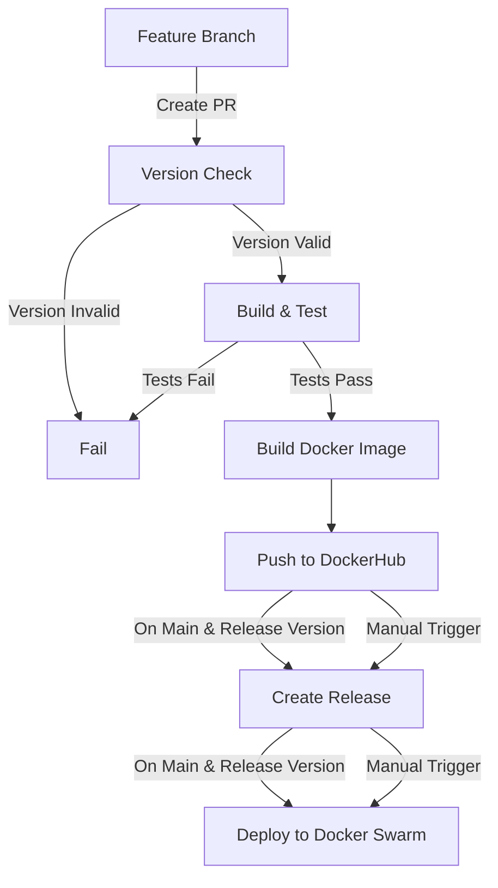

# Todo App

A reactive Spring Boot application for managing tasks with a RESTful API.

## Description

Todo App is a simple task management application built with Spring Boot and WebFlux. It provides a reactive API for streaming and paginating tasks. The application uses PostgreSQL for data persistence and Flyway for database migrations.

## Technologies Used

- Java 21
- Spring Boot 3.5.3
- Spring WebFlux (Reactive Web)
- Spring Data JPA
- PostgreSQL
- Flyway (Database Migrations)
- Lombok
- Docker & Docker Compose
- Gradle

## Prerequisites

- Java 21 or higher
- Docker and Docker Compose
- Gradle (or use the included Gradle wrapper)

## Setup and Installation

### 1. Clone the repository

```bash
git clone https://github.com/nzuwera/todo-app.git
cd todo-app
```

### 2. Start the PostgreSQL database

```bash
cd docker-compose
docker-compose -f postgres.yaml up -d
cd ..
```

This will start:
- PostgreSQL database on port 5432
- pgAdmin web interface on port 5050 (accessible at http://localhost:5050)

### 3. Build and run the application

Using Gradle wrapper:

```bash
./gradlew bootRun
```

Or using your installed Gradle:

```bash
gradle bootRun
```

The application will start on port 8080 by default.

## Configuration

The application uses environment variables for configuration. These are loaded from the `.env` file in the project root:

```properties
POSTGRES_HOST=<DB_HOST>
POSTGRES_PORT=<DB_PORT>
POSTGRES_DB=<DB_NAME>
POSTGRES_USER=<DB_APP_USERNAME>
POSTGRES_PASSWORD=<DB_APP_PASSWORD>
```

Database credentials for Docker containers are in `docker-compose/.env`:

```properties
POSTGRES_USER=<DB_APP_USERNAME>
POSTGRES_PASSWORD=<DB_APP_PASSWORD>
POSTGRES_DB=<DB_NAME>
PGADMIN_DEFAULT_EMAIL=<PGADMIN_LOGIN_EMAIL>
PGADMIN_DEFAULT_PASSWORD=<PGADMIN_LOGIN_PASSWORD>
```

## Database Access

You can access the PostgreSQL database using pgAdmin:

1. Open http://localhost:5050 in your browser
2. Login with the credentials from `docker-compose/.env`:
   - Email: <PGADMIN_LOGIN_EMAIL>
   - Password: <PGADMIN_LOGIN_PASSWORD>
3. Add a new server with the following details:
   - Name: todo-app
   - Host: postgres
   - Port: 5432
   - Database: <DB_NAME>
   - Username: <DB_APP_USERNAME>
   - Password: <DB_APP_PASSWORD>

## Development

### Running Tests

```bash
./gradlew test
```

### Building the Application

```bash
./gradlew build
```

This will create a JAR file in the `build/libs` directory.

## CI/CD Workflow

This project uses a comprehensive GitHub Actions workflow for continuous integration and continuous deployment.

### Workflow Overview



### Version Management

#### Version Format
- Production releases: `1.0.2` (in build.gradle: `version = '1.0.2'`)
- Development releases: `1.0.2-SNAPSHOT` (in build.gradle: `version = '1.0.2-SNAPSHOT'`)

#### Versioning Rules
1. When creating a new feature branch, increment the version in `build.gradle` according to semantic versioning:
   - Major version (x.0.0): Breaking changes
   - Minor version (0.x.0): New features, backward compatible
   - Patch version (0.0.x): Bug fixes, backward compatible
2. Always use `-SNAPSHOT` suffix for development work
3. Remove `-SNAPSHOT` suffix when ready for production release

#### Version Control
- The workflow automatically checks if the PR version is greater than the main branch version
- SNAPSHOT versions will build and test, but won't automatically release or deploy
- Non-SNAPSHOT versions will automatically trigger releases and deployments when merged to main

### Manual Workflow Control

You can manually trigger the workflow with different options:

1. **build-only**: Only build and test the application
2. **build-and-release**: Build, test, and create a GitHub release
3. **build-release-deploy**: Build, test, create a GitHub release, and deploy to Docker Swarm

### Required Secrets

Add these secrets to your GitHub repository:

- `DOCKERHUB_USERNAME`: Your DockerHub username
- `DOCKERHUB_TOKEN`: Your DockerHub access token
- `SSH_PRIVATE_KEY`: SSH key for Docker Swarm deployment (if using SSH)

### Development Workflow

1. **Create Feature Branch**:
   ```bash
   git checkout -b feature/new-feature
   ```

2. **Update Version in build.gradle**:
   ```gradle
   version = '0.3.1-SNAPSHOT'  # Increment from previous version
   ```

3. **Make Changes and Commit**:
   ```bash
   git add .
   git commit -m "Implement new feature"
   ```

4. **Push Changes**:
   ```bash
   git push origin feature/new-feature
   ```

5. **Create Pull Request**:
   - GitHub Actions will automatically:
     - Check if your version is greater than the main branch version
     - Run unit and integration tests separately
     - Build the application

6. **Review and Merge**:
   - After PR is approved and merged to main:
     - The workflow will build a Docker image
     - Push it to DockerHub
     - If it's a non-SNAPSHOT version, create a GitHub release and deploy

7. **For Production Release**:
   - Update version in main branch, removing `-SNAPSHOT` suffix
   - Push directly to main or via PR
   - The workflow will create a production release and deploy

## License

This project is licensed under the MIT License.
